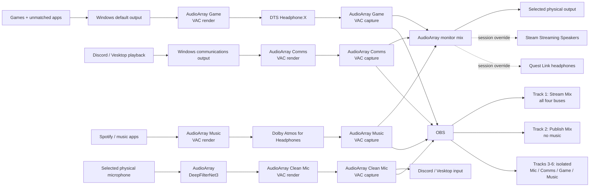

# AudioArray

AudioArray is Alex's private cross-platform streaming-audio graph. Its Windows
engine is paired with a Tauri operations console; a future Linux engine will
implement the same Rust status/control contract beneath the identical UI. The
four buses stay intentionally boring:

- **Game**: the Windows default for games and otherwise-unassigned applications.
- **Comms**: Discord/Vesktop playback.
- **Music**: Spotify and other music players.
- **Clean Mic**: the selected Windows input after DeepFilterNet3 suppression.

Windows exposes both ends of the signed VAC cables with semantic names instead
of the driver's generic `Line N` labels:

- **AudioArray Game**: normal/default playback and OBS's isolated game capture.
- **AudioArray Comms**: communications playback and OBS's isolated chat capture.
- **AudioArray Music**: music playback and OBS's isolated music capture.
- **AudioArray Clean Mic**: the suppressed microphone selected by chat apps and OBS.

AudioArray makes Game the normal Windows output, Comms the Windows
communications output, and Clean Mic the normal and communications input.
Games without their own device picker therefore land on Game automatically.
Choosing a physical device in the Windows input or output picker updates
AudioArray's recency-ordered hardware history; AudioArray then restores the
virtual defaults so applications cannot bypass the graph. If the preferred
device disappears or cannot provide a usable shared-mode format, AudioArray
walks that history until it finds one that works.

## Driver boundary

AudioArray does not install an unsigned kernel driver. It uses four endpoints
from Eugene Muzychenko's signed [Virtual Audio Cable](https://vac.muzychenko.net/en/)
driver. The licensed installer is private and must never be committed here.

DTS Headphone:X is attached to the AudioArray Game render endpoint and Dolby
Atmos for Headphones is attached to the AudioArray Music render endpoint. The
spatial renderers therefore become part of those two bus signals before
AudioArray monitors them or OBS records their isolated stems. DTS Sound Unbound,
Dolby Access, and SoundVolumeView are declared Windows dependencies; the latter
provides a deterministic command-line setter and verifier for the per-endpoint
Windows Spatial Sound selection.

The same reconciliation resets every visible endpoint and VAC Main/pin stage to
`0.00 dB` after applying the spatial formats. VAC maps unity gain to misleading
percentage values such as 63% or 24.9%; its 100% position is actually a `+12 dB`
boost and is intentionally not used.

VAC playback applications write into each cable's render endpoint. AudioArray
captures the matching recording endpoint and monitors Game, Comms, and Music to
the first usable remembered physical output. During a Sunshine/Moonlight
session, Sunshine temporarily makes Steam Streaming Speakers the Windows
default. AudioArray observes that real transition, sends the complete mix there,
and yields the render defaults until Sunshine restores them at disconnect. Meta
Quest Link receives the same treatment when Oculus Virtual Audio becomes the
Windows default, so the headset gets the complete mix without becoming a
remembered physical output. OBS's separate tracks remain untouched. It
captures the remembered physical input, processes it with the embedded
DeepFilterNet3 model, and writes Clean Mic into its VAC render endpoint for
Discord and OBS to consume. The tracked speech-first tuning limits attenuation
to 20 dB and disables the optional post-filter so quiet syllables are not
mistaken for noise and erased.

## Signal graph



## Intrepid operations console

The native `audioarray-ui.exe` console visualizes that graph in real time. It
uses the same source-grounded Voyager-era Intrepid LCARS contract as Torplex:
Antonio typography, a silver structural frame, command-gold headings, sky-blue
telemetry, fixed black segmentation, and the canonical responsive elbows and
bar sequence. It reuses Torplex's key, confirmation, denial, and search clips,
but intentionally includes no bridge ambience or generic background hum.

The first interface release is operationally conservative. It provides:

- the complete signal graph with activity-driven routes;
- live meters for the physical mic, four buses, and final monitor output;
- background-engine, routing-policy, session-override, format, filter, and
  latency telemetry;
- the declarative application routes and six-track OBS recording matrix; and
- editable Main Input and Main Output selectors.

Those selectors do not create a second device-selection system. They briefly
apply the chosen physical endpoint through Windows' normal default-device
policy. The background engine observes and remembers that choice, then restores
the AudioArray virtual defaults exactly as it does when a device is selected in
Windows Settings. Either interface therefore produces the same durable result.

The tray icon represents the complete AudioArray lifecycle. Its process owns
and supervises the separate hidden low-latency engine: closing the console hides
it to the tray without interrupting audio, **Restart Array** replaces the engine
while leaving the console available, and **Exit AudioArray** stops both the
engine and interface so the entire graph is offline. The Windows login task
starts that tray supervisor rather than an independently orphanable engine. A
left click restores the console; the Start-menu shortcut does the same through
single-instance activation.

In an application's device picker, choose **AudioArray Game** for ordinary
sound, **AudioArray Comms** for chat playback, **AudioArray Music** for music,
and **AudioArray Clean Mic** for microphone input. Apps without a device picker
inherit the appropriate Windows default automatically.

## Commands

```text
audioarray devices
audioarray doctor
audioarray select-output "Headphones (Oculus Virtual Audio Device)"
audioarray select-input "Microphone (Yeti Stereo Microphone)"
audioarray endpoints
audioarray benchmark
audioarray levels
audioarray run
audioarray example-config
```

Quest Link is modeled as a temporary adapter around the same graph rather than
as another bus. Its headphones receive the complete Game/Comms/Music monitor
mix and its microphone temporarily replaces the raw local mic before
DeepFilterNet3. Applications continue to see the stable AudioArray buses and
Clean Mic endpoints. When the Quest session ends, AudioArray restores the most
recent available physical input and output from its machine-local history.

The operations console can bypass DeepFilterNet3 entirely or adjust its
suppression intensity from 0–100%. Intensity maps to a 0–40 dB maximum
attenuation range; the tracked 20 dB default therefore appears as 50%. A change
restarts only the supervised audio engine, leaving the tray console alive. The
choice is stored in `%APPDATA%\AudioArray\controls.toml`, separate from the
declarative base graph, so a later dotfiles reconciliation does not erase it.

The topology wires render live PCM-derived waveforms rather than decorative
motion. The existing capture probes retain a 240 ms rolling signal window for
the physical microphone and each bus, reduce it to standard min/max waveform
bins, and publish snapshots to the interface at roughly 30 Hz. New samples
enter at each source and age toward its destination, so visible transients
actually travel through the graph. The raw and DeepFilterNet Clean Mic paths
remain independent, while Main Output and OBS use derived monitor and complete
mix waveforms. Waveform samples use a fixed spatial pitch across every route,
so short and long wires show the same oscillation density instead of squeezing
or stretching the captured signal to fit their individual lengths.

The Windows setup script builds both release binaries, reconciles the tracked
configuration into `%APPDATA%\AudioArray\config.toml`, starts the unified tray
lifecycle at interactive logon, and installs the console shortcut. Edit
`config.example.toml` through the `~/code/AudioArray` workspace when changing
the graph. Use `RUST_LOG=audioarray=debug` for verbose diagnostics.
